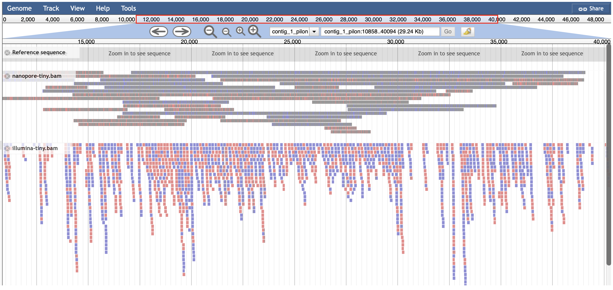
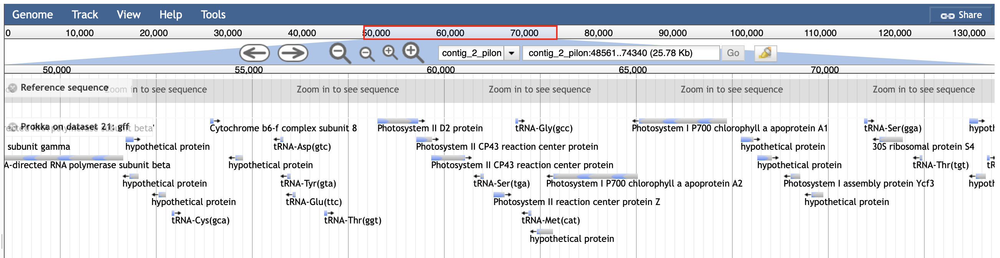

# Introduction to Galaxy and Sequence Analysis
This is a learning pathways from Galaxy Training and below are the tools and their respective documentation following the structure of the course.

## Introduction to Galaxy
Given 12480 short sequence reads (in .fastq), generate a sequence quality report and filter out low quality reads

1. Quality report
- using `fastqc` and/or `falco` to perform high throughput quality check
- the contents of the report are as follow:

| Summary | Discription |
| --- | --- |
| Basic Statistics | Total sequences, total bases (per sequence), sequence length (eg. 150 or 200), %GC |
| Per base sequence quality | Distribution of base quality (shown in boxplot per 5 bases) across the sequence where 40-28 (green), 28-20 (yellow), 20-0 (red) |
| Per sequence quality scores | Line graph of base quality over the number of sequence |
| Per base sequence content | Content percentage of each type of base (A-G-T-C) per 5 bases across the sequence |
| Per sequence GC content | Distribution of GC content percentage of the sequences |
| Per base N content | Content percentage of unknown base per 5 bases across the sequence |
| Sequence Length Distribution | Distribution of length (bp) of the sequences |
| Sequence Duplication Levels | Percentage of sequnce duplication over duplication rate |
| Overrepresented sequences | Overreprented sequences |
| Adapter Content | Percentage of adapter content across the sequence |

2. Filter low quality reads 
Low-quality reads can be filtered by the base quality score (q) and percentage of bases in a sequence that has >= q.

## Basics for Genomics
Given datasets containing a list of exons (protein coding region) in chromosome 22 and a list of SNPs (single nucleotide polymorphisms) known to exist in the same chromosome, find the top 5 exons that has the most number of SNPs.

1. Find intersection between the list of exons and SNPs
2. Group by exon ID, then count the number of snps per exon
3. Sort the exon SNPs count by number of snps in ascending order
4. Filter only the top 5 exons
5. Cross referencing to recover the exons' data 

| Chromosome | Starting base pair | Ending base pair | Exon ID | No. of SNPs |
| --- | --- | --- | --- | --- |
| chr22	| 46256560 | 46263322 | ENST00000253255.7_cds_0_0_chr22_46256561_r | 27 |
| chr22	| 50546243 | 50549951 | ENST00000648057.3_cds_0_0_chr22_50546244_f | 26 |
| chr22	| 31712082 | 31717291 | ENST00000327423.11_cds_5_0_chr22_31712083_r | 20 |
| chr22	| 22514001 | 22515630 | ENST00000302097.3_cds_0_0_chr22_22514002_r | 14 |
| chr22	| 49883662 | 49887178 | ENST00000216268.6_cds_1_0_chr22_49883663_f | 13 |

## Quality Control
Given 4 different types of input below, perform quality control on them.

1. Single-end short reads FASTQ
- Generates max / mean / min quality score of each base position across all sequences in **emoji** instead of usual score in ASCII code using **`fastqe`**.
- Generate quality report using **`fastqc`**.
- Trim adapters and filter out the low-quality base pairs using **`cutadapt`**.

2. Paired-end short reads FASTQ
- Generate quality report on forward and reverse short reads using **`fastqc`**, usually qc(forward) > qc(reverse).
- Generate quality report using the raw data files above using **`multiqc`**.
- Trim adapters (forward and reverse have different adapters) using **`cutadapt`**, trimmed FASTQ of both FASTQ have to be of the same bps for each sequence.

3. Nanopore long reads FASTQ
- It consists of long sequences produced by changes in electrical current through microscopic pores.
- Generate quality report of the nanopore long reads using **`nanoplot`**.

4. Nanopore reads summary
- Generate quality report using **`pycoqc`**.

## Mapping
1. Build the Mus musculus MM10 genome reference index using **`bowtie2-build`**.
2. Map the paired-end reads to the MM10 index to produce alignment BAM file using  **`bowtie2`**.
3. Generate stats for the BAM file using **`samtools stats`** to examine the alignment quality.
4. Perform filtering on the alignment using **`samtools view`**.
5. Generate stats for the filtered BAM file (expect for improvement).

## Genome Assembly
Given forward and reverse short reads (paired-end), perform genome assembly and assessment.
1. Perform **`fastqc`** on both reads to generate raw data and html report.
2. Perform **`multiqc`** on both raw data files to combine the fastqc report of both reads.
3. Combine the paired-end FASTQ files into a single interleaving FASTQ file.
4. Assemble the genome from the interleaved FASTQ using **`velvet`**.
5. Assemble the genome from the raw FASTQ files using **`SPAdes`**.
6. Perform assessment on the genome assembled by both velvet and SPAdes.

## Chloroplast Genome Assembly
Given a short reads and a nanopore long reads of sweet potato chloroplast, perform genome assembly and visualize the assembled genome.
1. Perform **`fastqc`** on the illumina short read FASTQ.
2. Perform **`nanoplot`** on the nanopore long read FASTQ.
3. Assemble the nanopore long reads using **`flye`** to produce an assembly FASTA.
3. Create assemble index of the nanopore using **`bwa index`** (Burrows-Wheeler Aligner).
4. Mapping the illumina short reads FASTQ to the nanopore assembly FASTA using **`bwa mem`** to produce a BAM file (Binary Alignment Map).
4. Create index of the BAM file using **`samtools index`**.
5. Polish the nanopore assembly FASTA with the BAM file using **`pilon`** to produce a polished assembly FASTA.
6. Examining the stats of the assembly and the polished assembly FASTA using **`seqkit stats`**.

    

7. Perform genome annotation using **`Prokka`** to examine the identified protein, nucleotides etc from the assembled genome.
7. Perform genome annotation using **`JBrowse`** to visualize the annotation.

    

